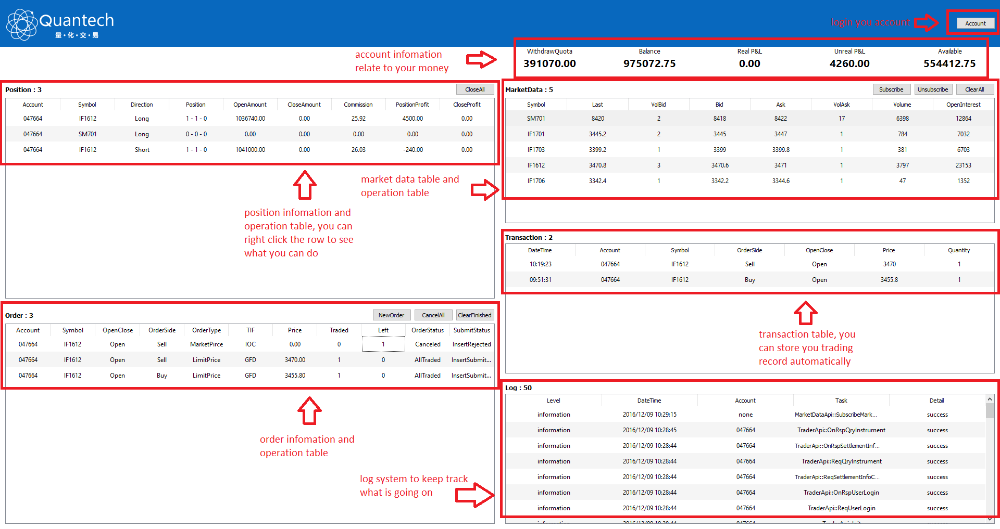
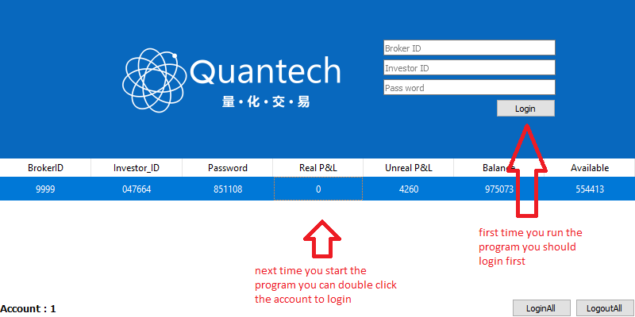
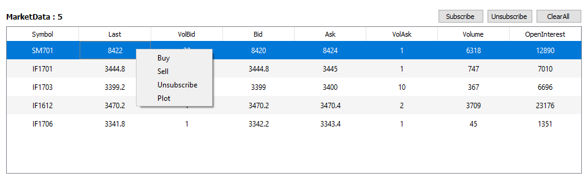
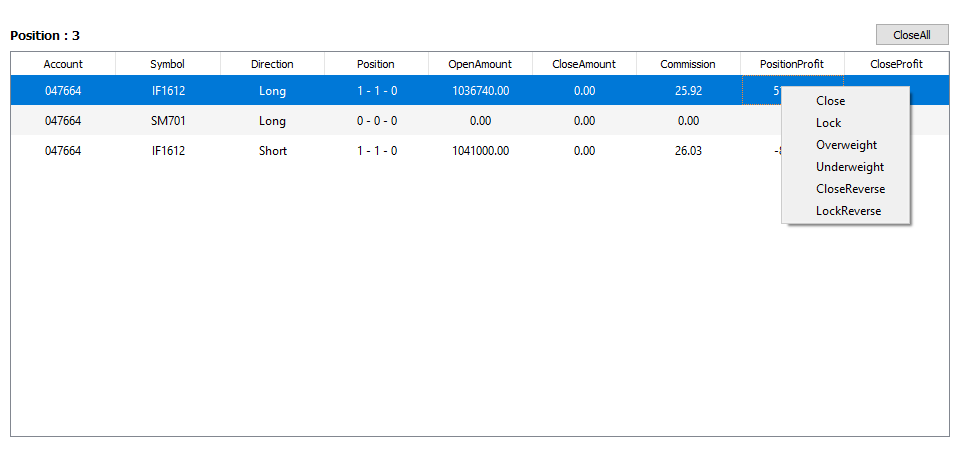
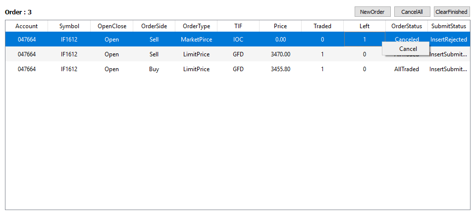
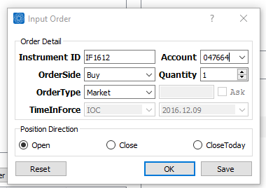
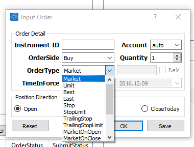
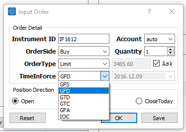

# Quantech : a high-performance trading software
# 

# Introduction

In todays financial market of US, up to 99% of the brokers and traders use their own trading software which was build with
quantitative analyse and math model for they can take the benefits of 1. _Automated_ all strategy can be fully automated;
2. _Fast_ use special network and special machine to send order; 3. _Reliable_ built on robust architecture and state-of-the-art technologies;
but in todays china, we can not find such a dealer or software privider that privide the technolog or something you can use to
take the benefits, and yes, you can find something like trade blazer or wenhua, but you must write the strategy yourself, and
pay a good deal of money to buy the membership. ok, now that is why quantech comes! 

<pre>
<b>it will let every one in the world to benefit from the quantitative trading! 
it is free of charge and can be freely distributed.</b>
</pre>

# Main features

* programming in c++ integrated with intel TBB, berkeleyDB & QT
* lock free & multicore programming
* lapack & blas to do the math work
* multiple chart
* multiple account
* 100% hands free
* base on CTP Api

# Recommand PC hardware

* CPU : >= intel i3, intel i7 or xeon is prefered
* Memory : >= 4GB, 8GB is prefered
* Harddisk : >= 80GB, 1TB is prefered

# Installation

## Windows
clone/copy to your pc and install vc_redist.x86 which in the folder you cloned/copied

## Linux
to be done

## macOS
to be done

# Usage

double click the Quantech.exe to start the program

# Turorial
i'm sure you can learn this staff within 10 min

## Overview
when you start the program (i must confess the demo picture is suck, open in new tab to see more clearly)

press the account button, 

## Detail
in the market data table, you can subscribe/unsubcribe the instrument you interest in (you must login first, or you
 will get nothing to subcribe), and the strategy only deal with the instrument you subcribed,
right click the instrument you subscribed to take an action, multiple selection is supported.
**double click to plot the instrument**

in the position table, you take action such like close, close all, lock, overweight etc. attension: the action in position table
all make with market price type, so, if you use simulation account logined, your order will be rejected by the exchange, simulation
account can only use limit price type and GFD time in force. just right click to see what happen, multiple selection is supported.
**double click to close the position**

the most important table you should pay attention to is order table, it record what you have done and what the exchange
reply to your order, when something unexpected happen, you can cancel or cancel all your order, multiple selection is supported.
**double click to cancel the order**

there has a pretty and fancy dialog named input order dialog, it is compact and has full functionality about how you
can make your order

## Special introduction

###what is order type and how to choose appropriate order type?

 order type        | meaning       | transaction prob.  
--- | --- | ---
 Market            | buy or sell at market price, it can eat up the liquidity | immediate 
 Limit             | buy or sell at you specify price   |   middle  
 Best              | buy at bid1 or sell at ask1      | middle 
 Last 		    | buy or sell at last price     | high 
 Stop 		    | close at market price when stop price triggered     | immediate 
 StopLimit 	    | close at limit price when stop price triggered     | middle 
 TrailingStop      | your stop price will change accroding to the market movement if triggered close at market price | middle 
 TrailingStopLimit | your stop price will change accroding to the market movement if triggered close at limit price  | middle 
 MarketOnOpen 	    | as it said | low 
 MarketOnClose     | as it said | low 
 MarketIfTouch     | as it said | low 
 LimitOnOpen       | as it said | low 
 LimitOnClose      | as it said | low 
 LimitIfTouch      | as it said | low 
 FOK               | fill or kill, your order can be dealed or canceled, only two status |middle 
 FAK               | fill and kill, your order can be partially filled the left will cancel      |middle 

###what is time in force and how to choose appropriate time in force?

# Contact
trading_robot at outlook dot com

# License

[Apache License 2.0](license.txt)